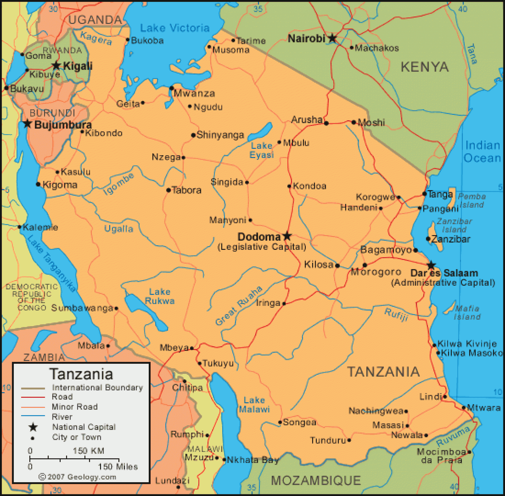
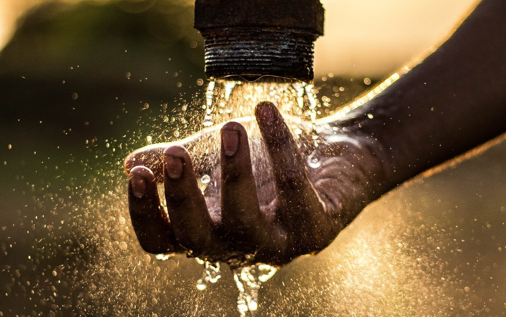

# Tanzania Waterpoint Operational Status

## Phase 3 Project
### Flatiron Online Data Science Bootcamp

Prepared and presented by: [Leah Pope](https://www.linkedin.com/in/leahspope/) (full time Data Science student)

Presentation: [here](PhaseThreeProject_LeahPope.pdf)

Presentation Video: [here](linkgoeshere)






# Introduction

The goal of this project is to use data from the Tanzania Ministry of Water to gain insight into the country's waterpoints.   

The Stakeholders for my project are Tanzania Ministry of Water officals who want a dashboard view of the country's offical waterpoints. Addtionally, the officals want to know if Classifer can be created using the current  data to predict waterpoint operational status.  A data-supported understanding of which waterpoints may be more likely to fail can improve maintenance operations and ensure that clean, potable water is available to communities across Tanzania.


# Data Description

Data Set Used: Waterpoint data for the Republic of Tanzania:
* tza_waterpoint_train.csv
    * 59400 records in Original Training Set
* tza_waterpoint_test.csv
    * 14850 records in Original Test Set
* Data is from the [Pump It Up: Data Mining the Water Table Challenge hosted on DrivenData](https://www.drivendata.org/competitions/7/pump-it-up-data-mining-the-water-table/page/23/)


# EDA Questions Explored
### Question 1: Dashboard Question 1
#### [Notebook](./notebooks/eda.ipynb)


### Question 2: Dashboard Question 2 
#### [Notebook](./notebooks/eda.ipynb)


### Question 3: Dashboard Question 3
#### [Notebook](./notebooks/eda.ipynb)


# Modeling
### Can current data on waterpoints be used to create a Classifer to predict operational status?
#### [Notebook](./notebooks/model.ipynb)


# Next Steps/Future Work

Futher analysis into the following areas could yield additional insights.

* __idea 1__  Details:
    * Item 
    * Item

* __idea 2__  Details:
    * Item 
    * Item


# For More Information
* Review the non-technical presentation [here](addlink)
* View the non-technical presentation video [here](PhaseThreeProject_LeahPope.pdf)
* Read the blog post (TBD) [here](addlink)
* Contact the author [Leah Pope](https://www.linkedin.com/in/leahspope/)


# Repository Structure
```
--notebooks
----data_cleaning.ipynb
----eda.ipynb
----model.ipynb
----model_playground.ipynb
--data
----tza_waterpoint_train.csv
----tza_waterpoint_test.csv
```
